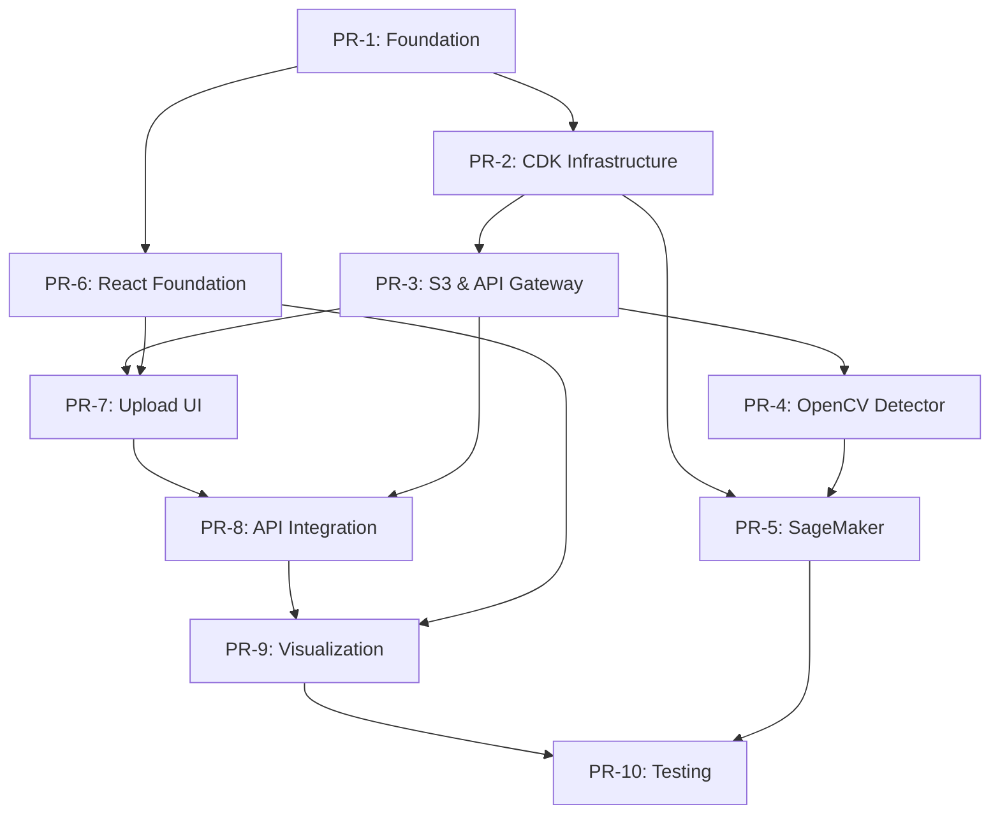

# Location Detection AI - Documentation Index

## 📚 Documentation Structure

This directory contains comprehensive documentation for building the Location Detection AI system through a parallel swarm development approach.

## 🎯 Quick Start

1. **Read**: [Product Requirements Document](LocationDetectionAI_PRD.md)
2. **Plan**: [PR Execution Plan](PR-EXECUTION-PLAN.md)
3. **Execute**: Follow PR documents in dependency order

## 📋 PR Documentation (10 Total)

All PRs are designed for **junior engineer execution** with step-by-step instructions, verification steps, and estimated completion times.

### Foundation & Infrastructure

#### [PR-1: Project Foundation](PR-1-project-foundation.md)
**Duration**: 2-3 hours | **Dependencies**: None

Sets up repository structure, package management, Git configuration, and development environment.

**Key Deliverables**:
- Monorepo structure
- npm workspaces
- CI/CD workflows
- Documentation templates

---

#### [PR-2: AWS CDK Infrastructure](PR-2-aws-cdk-infrastructure.md)
**Duration**: 3-4 hours | **Dependencies**: PR-1

Initializes AWS CDK project with base infrastructure stack for KMS encryption and IAM roles.

**Key Deliverables**:
- CDK TypeScript project
- Base infrastructure stack
- Environment configuration
- Unit tests

---

#### [PR-3: S3 Storage and API Gateway](PR-3-s3-api-gateway.md)
**Duration**: 4-5 hours | **Dependencies**: PR-2

Creates S3 buckets, API Gateway, and Lambda functions for file upload orchestration.

**Key Deliverables**:
- Blueprint & results S3 buckets
- HTTP API Gateway
- Upload handler Lambda
- Status handler Lambda

---

### AI/ML Pipeline

#### [PR-4: OpenCV Room Boundary Detector](PR-4-opencv-detector.md)
**Duration**: 4-5 hours | **Dependencies**: PR-3

Implements computer vision algorithm for detecting room boundaries using OpenCV.

**Key Deliverables**:
- OpenCV detector class
- Contour detection algorithm
- Unit tests (>90% coverage)
- CLI tool for local testing

---

#### [PR-5: SageMaker Async Inference](PR-5-sagemaker-async-inference.md)
**Duration**: 5-6 hours | **Dependencies**: PR-2, PR-4

Deploys OpenCV detector to SageMaker Async Inference for scalable processing.

**Key Deliverables**:
- Docker container
- SageMaker model/endpoint
- Async inference configuration
- S3 event trigger Lambda

---

### Frontend Development

#### [PR-6: React Frontend Foundation](PR-6-react-frontend-foundation.md)
**Duration**: 3-4 hours | **Dependencies**: PR-1

Sets up React + Vite application with Material UI, routing, and development tooling.

**Key Deliverables**:
- Vite + React + TypeScript
- Material UI dark theme
- React Router
- TanStack Query setup

---

#### [PR-7: Blueprint Upload and Visualization](PR-7-blueprint-upload-visualization.md)
**Duration**: 3-4 hours | **Dependencies**: PR-3, PR-6

Implements file upload UI with drag-and-drop, preview, and progress tracking.

**Key Deliverables**:
- File upload component
- Drag-and-drop support
- Upload progress tracking
- Error handling

---

#### [PR-8: API Integration and State Management](PR-8-api-integration-state-management.md)
**Duration**: 3-4 hours | **Dependencies**: PR-3, PR-7

Completes API integration with polling, error handling, and notification system.

**Key Deliverables**:
- React Query hooks
- Job status polling
- Notification system
- Retry logic with exponential backoff

---

#### [PR-9: Room Boundary Rendering](PR-9-room-boundary-rendering.md)
**Duration**: 4-5 hours | **Dependencies**: PR-6, PR-8

Implements canvas-based visualization of detected room boundaries.

**Key Deliverables**:
- Canvas rendering (react-konva)
- Interactive room selection
- Room details panel
- Export functionality (JSON/CSV)

---

### Quality Assurance

#### [PR-10: Testing and Documentation](PR-10-testing-documentation.md)
**Duration**: 5-6 hours | **Dependencies**: ALL previous PRs

Comprehensive testing suite and documentation for the complete system.

**Key Deliverables**:
- Unit tests (>80% coverage)
- E2E tests (Playwright)
- API documentation
- Deployment guide

---

## 🚀 Execution Strategy

### Sequential Execution (1 Engineer)
**Total Time**: 36-46 hours (1-2 weeks)

Execute PRs in dependency order:
1. PR-1 → PR-2 → PR-3 → PR-4 → PR-5
2. PR-6 → PR-7
3. PR-8 → PR-9
4. PR-10

### Parallel Execution (3 Engineers)
**Total Time**: 15-20 hours (3-4 days)

**Phase 1**: PR-1 (Foundation)
**Phase 2**: PR-2 → PR-3 (Backend) || PR-6 (Frontend)
**Phase 3**: PR-4 → PR-5 (AI/ML) || PR-7 (Upload)
**Phase 4**: PR-8 (Integration) → PR-9 (Visualization)
**Phase 5**: PR-10 (Testing)

### Swarm-Assisted Execution
**Total Time**: 10-15 hours (2-3 days)

Use Claude Flow swarm coordination:
```bash
npx claude-flow@alpha swarm init --topology mesh --max-agents 3
npx claude-flow@alpha agent spawn --type backend-dev
npx claude-flow@alpha agent spawn --type frontend-dev
npx claude-flow@alpha agent spawn --type ml-developer
```

## 📊 Dependency Visualization



## 🎓 For Junior Engineers

Each PR document includes:
- ✅ **Clear objectives** - What you're building
- 📝 **Step-by-step instructions** - Exact commands to run
- ✔️ **Verification steps** - How to know it works
- ⏱️ **Time estimates** - How long each step takes
- 📚 **Acceptance criteria** - Definition of done
- 🧪 **Testing instructions** - How to test your work
- 💡 **Learning notes** - Important concepts explained
- ⚠️ **Common pitfalls** - Things to watch out for

### Key Principles

1. **Follow dependencies** - Don't start a PR until dependencies are merged
2. **Run verification steps** - After each step, verify it works
3. **Ask for help early** - Don't spend hours stuck on one error
4. **Commit frequently** - After each major step completes
5. **Read error messages** - They usually tell you exactly what's wrong
6. **Use exact commands** - Copy/paste to avoid typos
7. **Check PR acceptance criteria** - Before marking complete

## 📖 Additional Resources

- [Product Requirements Document](LocationDetectionAI_PRD.md) - Full system requirements
- [PR Execution Plan](PR-EXECUTION-PLAN.md) - Detailed execution strategy
- [AWS CDK Documentation](https://docs.aws.amazon.com/cdk/)
- [React Query Documentation](https://tanstack.com/query/latest)
- [Material UI Components](https://mui.com/material-ui/getting-started/)

## 🔧 Development Tools Required

### Backend
- Node.js 18+
- Python 3.9+
- Docker
- AWS CLI
- AWS Account

### Frontend
- Node.js 18+
- npm or yarn
- Modern browser (Chrome/Firefox)

### Infrastructure
- AWS CDK CLI
- TypeScript
- Git

## 🎯 Success Metrics

**System Performance**:
- Processing latency: <30 seconds per blueprint
- API response time: <2 seconds
- Upload success rate: >95%
- Detection accuracy: Visual correctness

**Code Quality**:
- Test coverage: >80%
- TypeScript strict mode: Enabled
- Linting: Zero errors
- Build: Zero warnings

**Documentation**:
- All APIs documented
- Deployment guide complete
- README updated
- PR descriptions filled

## 🆘 Getting Help

If you encounter issues:
1. Check the "Notes for Junior Engineers" section in the PR doc
2. Review verification steps - did they all pass?
3. Search error messages online
4. Check if dependencies are properly merged
5. Ask for help with specific error output

## 📄 License

MIT License - See LICENSE file for details

## 👥 Contributors

- Innergy AI Team
- Built with Claude Code

---

**Last Updated**: November 2025
**Version**: 1.0.0
